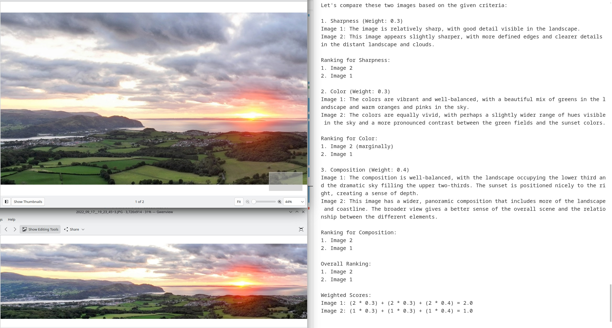
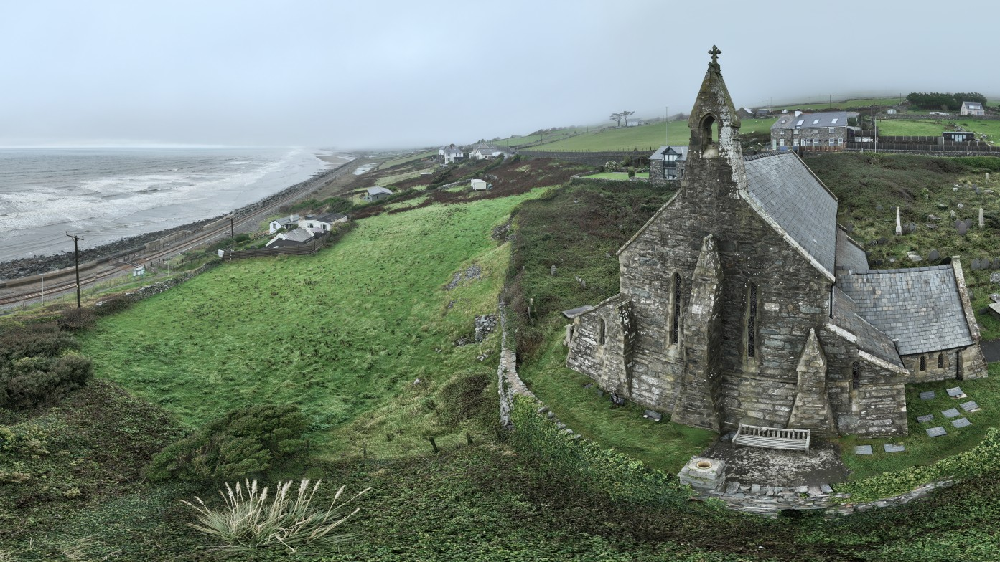
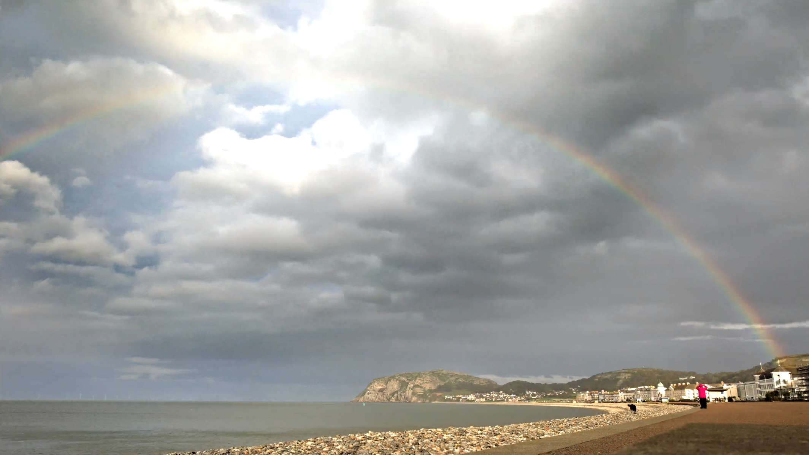
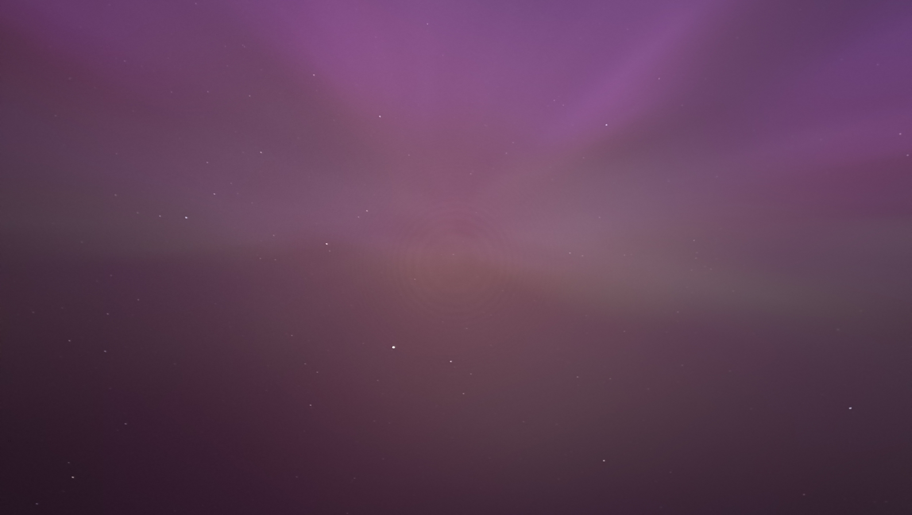
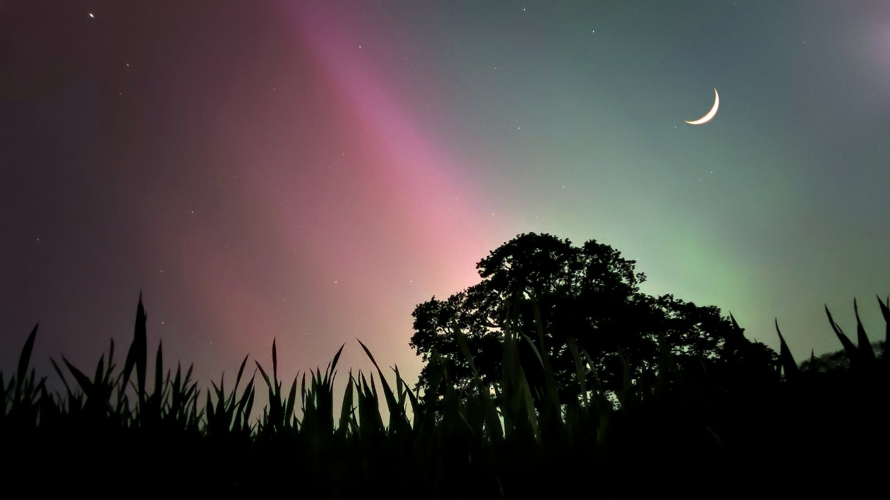

# Claude Vision CLI

https://github.com/user-attachments/assets/489a8dae-4366-4ff4-aa41-fb81a71160a1


```
claude-vision judge [IMAGE_PATHS]... --criteria "sharpness,color,composition" --weights "0.3,0.3,0.4" --output md
```




Claude Vision CLI is an advanced command-line tool for image and video analysis using the Claude 3.5 Sonnet vision model. This tool allows you to process one or more images or video frames, including images from URLs, and receive detailed descriptions or structured output based on the content. It can be used as part of a pipeline to support advanced analysis and automation.

## Examples:
- [Art Critic Analysis of Mona Lisa](#art-critic-analysis-of-mona-lisa)
- [Photography Judge: Lighthouse Comparison](#photography-judge-lighthouse-comparison)
- [Video Frame Analysis: Coastal Town](#video-frame-analysis-coastal-town)
- [Aurora Borealis Time-lapse Analysis](#aurora-borealis-time-lapse-analysis)

## Installation

To install Claude Vision CLI, follow these steps:

1. Clone the repository:
   ```
   git clone https://github.com/irthomasthomas/claude-vision.git
   cd claude-vision
   ```

2. Install the package:
   ```
   pip install -e .
   ```

3. Set up your Anthropic API key:
   ```
   export ANTHROPIC_API_KEY=your_api_key_here
   ```

## Usage

Claude Vision CLI offers several advanced features:

### Basic Analysis
```
claude-vision analyze [IMAGE_PATHS]... [OPTIONS]
```

## Art Critic Analysis of Mona Lisa
Example:
```
claude-vision analyze tests/images/mona-lisa.png --persona art_critic
```


<details>
<summary>Example Analysis / Click to expand</summary>

Analysis:

As an art critic, I can say this image is one of the most iconic and influential paintings in the history of Western art. It is, of course, the "Mona Lisa" by Leonardo da Vinci, painted in the early 16th century.

The composition is centered on a half-length portrait of a woman seated in front of a distant landscape. The subject's pose is notable for its subtle dynamism - her body is turned slightly to her left, while her gaze is directed toward the viewer, creating a sense of engagement and mystery.

The painting exemplifies Leonardo's mastery of sfumato, a technique that creates soft, hazy outlines through the gradual blending of tones and colors. This is particularly evident in the subject's facial features, giving her expression its famous ambiguity.

The background landscape is a masterpiece in itself, showcasing Leonardo's skill in atmospheric perspective. The scene transitions from the foreground to a misty, bluish distance, creating a sense of depth and space that was revolutionary for its time.

The color palette is subdued yet rich, with warm earth tones dominating the foreground and cooler hues in the background. The light falls gently on the subject's face and hands, highlighting these areas as focal points.

The subject's clothing and hair are rendered with meticulous attention to detail, from the folds of her dress to the delicate veil draped over her hair. Her hands are positioned in a relaxed, natural manner, adding to the overall sense of calm and poise.

This painting has captivated viewers for centuries with its technical brilliance, compositional harmony, and the enigmatic quality of the subject's expression. It remains a testament to Leonardo da Vinci's genius and continues to be one of the most studied and admired works of art in the world.


</details>


### Using stdin and stdout
You can pipe images into Claude Vision CLI:
```
 cat tests/images/church.jpg | claude-vision analyze --output json
```


<details>
<summary>Example output / Click to expand</summary>

```json
{
  "result": {
    "scene": "Coastal landscape with a historic stone church",
    "location": "Likely coastal Wales or similar UK coastal region",
    "main_elements": [
      {
        "element": "Stone church",
        "description": "Prominent in foreground, old stone construction with a spire topped by a cross, slate roof, surrounded by a small graveyard"
      },
      {
        "element": "Coastline",
        "description": "Visible in background, rough sea with waves, misty or foggy atmosphere"
      },
      {
        "element": "Landscape",
        "description": "Green, hilly terrain sloping down to the sea, scattered with houses and buildings"
      },
      {
        "element": "Railway line",
        "description": "Visible running parallel to the coast"
      }
    ],
    "atmosphere": "Moody, misty, and atmospheric with overcast sky",
    "color_palette": "Predominantly greens, grays, and muted earth tones",
    "additional_details": [
      "Small houses and buildings dotted across the landscape",
      "Vegetation including grass and what appears to be pampas grass in the foreground",
      "Graveyard stones visible around the church",
      "A bench placed near the church",
      "The scene suggests a remote, possibly rural coastal community"
    ]
  },
  "analysis_type": "description"
}

```

</details>


## Video Frame Analysis: Coastal Town

```
claude-vision analyze /home/ShellLM/Videos/videoslideshow.mp4 --video --frame-interval 60 -num-workers 8
```



<details>
<summary>Example output / Click to expand</summary>

## Video Analysis: Coastal Town

Frame 0 (0.00s): This image captures a striking coastal scene with dramatic weather conditions. The sky is dominated by heavy, gray clouds, creating a moody atmosphere. A vivid rainbow arcs across the sky, adding a splash of color to the otherwise somber palette.

In the foreground, we see a pebble beach stretching along the coastline. The beach appears to be mostly empty, with just a few indistinct figures visible in the distance, suggesting it might be a cooler or off-season day.

The shoreline curves around to the left, where we can see a town nestled against the base of a large, rocky hill or small mountain. The buildings along the waterfront are predominantly white, typical of many coastal towns. Some of these structures appear to be larger, possibly hotels or other tourist accommodations.

In the middle ground, the sea is visible, looking calm and gray, reflecting the overcast sky above. The water meets the pebble beach in a gentle curve.

The right side of the image shows some larger buildings, possibly part of a promenade or seafront development. One building in particular stands out, appearing to have scaffolding or some kind of construction work in progress.

The overall mood of the image is one of brooding beauty. The contrast between the dark, threatening sky and the hopeful symbol of the rainbow creates a compelling visual narrative. The scene suggests a place where nature's power and beauty are on full display, even on a gloomy day.

Frame 60 (60.00s): This video frame captures a dramatic coastal scene with a mix of natural beauty and human presence....

</details>


## Visual Judge

Compare and rank multiple images based on given criteria:

## Photography Judge lighthouse comparison

```
claude-vision judge tests/images/lighthouse-color-edit1.jpg tests/images/lighthouse-color-edit2.jpg --criteria "sharpness,color,composition" --weights "0.3,0.3,0.4" --output md
```


<details>
<summary>Example output / Click to expand</summary>

```
claude-vision judge tests/images/lighthouse-color-edit1.jpg tests/images/lighthouse-color-edit2.jpg --criteria "sharpness,color,composition" --weights "0.3,0.3,0.4" --output md
```


Image 1 (Top image):

Sharpness (0.4): 7/10 - The silhouette and lighthouse are well-defined, but some details are lost in the shadows.
Color (0.4): 8/10 - Beautiful warm sunset colors with a gradient from orange to purple.
Mood (0.2): 9/10 - Evokes a sense of contemplation and serenity.

Weighted score: (7 * 0.4) + (8 * 0.4) + (9 * 0.2) = 7.8

Image 2 (Bottom image):

Sharpness (0.4): 9/10 - Crisp details in the foreground, lighthouse, and waves.
Color (0.4): 8/10 - Vibrant blue sky contrasting with warm sunset hues.
Mood (0.2): 8/10 - Conveys a sense of adventure and exploration.

Weighted score: (9 * 0.4) + (8 * 0.4) + (8 * 0.2) = 8.4

Comparison:
- Sharpness: Image 2 is superior, with more visible details throughout.
- Color: Both images have strong color appeal, but Image 1 has a slightly more dramatic color palette.
- Mood: Image 1 evokes a stronger emotional response, but Image 2 is also impactful.

Ranking:
1. Image 2 (Bottom image): 8.4
2. Image 1 (Top image): 7.8

Winner: Image 2 (Bottom image)

The bottom image is declared the winner due to its superior sharpness and overall balanced composition. While both images are visually striking, Image 2 edges out Image 1 with its crisper details and vibrant color contrast between the blue sky and warm sunset hues.

</details>


### Image Evolution Analyzer

Analyze a series of images to describe changes over time:

## Aurora Borealis Time-lapse Analysis

```
claude-vision evolution tests/images/aurora-zenith-sky-IMG20240510235144.jpg tests/images/aurora-zenith-sky-IMG20240510235307.jpg --time-points "2024-05-10 23:51:44,2024-05-10 23:53:07" --output json
```

<details>
   <summary> Example Output / click to expand</summary>

   ```
   claude-vision evolution tests/images/aurora-zenith-sky-IMG20240510235144.jpg tests/images/aurora-zenith-sky-IMG20240510235307.jpg --time-points "2024-05-10 23:51:44,2024-05-10 23:53:07" --output json
   ```

   

   

   

   Based on the analysis of the images taken at 21:00, 23:51, and 23:53, here are the observed trends, patterns, and anomalies:

   ### Aurora Intensity

   1. 21:00: Moderate intensity, with distinct pink and green bands
   2. 23:51: High intensity, dominated by vibrant pink hues
   3. 23:53: Sustained high intensity, with pink and purple tones

   Trend: Aurora intensity increased significantly over time, peaking in the later images.

   ### Sky Clarity

   4. 21:00: Very clear, with crisp silhouettes and visible celestial objects
   5. 23:51: Slightly hazier, but still relatively clear
   6. 23:53: Similar to 23:51, with a slight haze present

   Trend: Sky clarity decreased slightly over time, but remained generally good throughout the observation period.

   ### Star Visibility

   7. 21:00: High visibility, numerous stars visible
   8. 23:51: Reduced visibility, fewer stars apparent
   9. 23:53: Similar to 23:51, with limited star visibility

   Trend: Star visibility decreased over time, likely due to the increasing aurora intensity.

   ### Notable Patterns and Anomalies

   - The crescent moon visible at 21:00 is not present in later images, possibly due to its setting or being out of frame.
   - The distinct aurora bands at 21:00 evolved into a more diffuse, all-encompassing glow by 23:51 and 23:53.
   - The foreground elements (trees, grass) visible at 21:00 are not present in later images, suggesting a change in camera angle or location.
   - The color shift from green-pink to predominantly pink-purple indicates a possible change in the aurora's chemical composition or altitude over time.

   Overall, the dataset shows a dynamic aurora display increasing in intensity while reducing sky clarity and star visibility over the observed time period.


</details>


### Persona-Based Analysis
Analyze an image using a specified professional and stylistic persona:
<!-- ```
claude-vision analyze tests/images/church.jpg --persona architect
``` -->
```
 claude-vision analyze tests/images/aurora-moon.jpg --output text --persona victorian_gent
```


<details>
<summary>Example Output / Click to expand</summary>
My dear fellow, what a most enchanting nocturnal scene we have before us! Allow me to regale you with a detailed account of this mesmerizing tableau.

In the foreground, we observe a verdant expanse of flora, silhouetted against the luminous firmament. The grasses and foliage stand like sentinels, their sharp outlines reminiscent of the finest lace work adorning a lady's handkerchief.

Rising majestically from this earthly carpet is a grand old tree, its spreading boughs reaching towards the heavens like the arms of a venerable patriarch. Its form is rendered in deepest ebony against the ethereal backdrop, a testament to nature's artistry.

But it is the sky, dear sir, that truly captures one's imagination! Behold the wondrous display of celestial illumination! To the left, a most becoming shade of rose suffuses the atmosphere, gradually melding into a serene turquoise as one's gaze travels rightward. This chromatic spectacle can only be the result of that rare and awe-inspiring phenomenon known as the Aurora Borealis.

Suspended in this empyrean canvas, we spy the delicate crescent of the moon, resembling nothing so much as a finely crafted piece of silver filigree. Its gentle luminescence casts a soft glow upon the earthly realm below.

And let us not overlook the myriad stars that speckle the vast expanse, twinkling like so many diamonds upon a noblewoman's evening gown.

In sum, my good man, we are privileged to witness a scene of such transcendent beauty that it stirs the very soul. It serves as a poignant reminder of the magnificent wonders that surround us in this grand universe, if only we pause to observe them with a discerning eye.

</details>

### Comparative Time-Series Analysis
Perform comparative time-series analysis on multiple images:
```
claude-vision time-series tests/images/aurora-moon.jpg tests/images/aurora-zenith-sky-IMG20240510235144.jpg tests/images/aurora-zenith-sky-IMG20240510235307.jpg --time-points "21:00,23:51,23:53" --metrics "aurora intensity,sky clarity,star visibility" --output md 
```

### Generate Alt-Text
Generate detailed, context-aware alt-text for an image:
```
claude-vision alt-text IMAGE_PATH --output md
```

## Features

- Analyze multiple local images or images from URLs
- Compare and rank images based on custom criteria
- Analyze image evolution over time
- Perform persona-based analysis with professional and stylistic personas
- Conduct comparative time-series analysis
- Generate detailed alt-text for web accessibility
- Choose between text, JSON, or Markdown output formats
- JSON output with automatic structure enforcement
- Automatic image resizing to meet API requirements
- Support for stdin and stdout, enabling integration with other tools

## Imaginative Use Cases
<!-- Todo: Use judge to place image sets on trial and delete the junkers. -->

1. **Automated Visual Inspection**: Use Claude Vision CLI in manufacturing to analyze product images for defects:
   ```
   find /path/to/product/images -type f -name "*.jpg" | xargs claude-vision compare --criteria "defects,alignment,color" --weights "0.5,0.3,0.2" --output json | jq '.defective_items[]' > defective_items.txt
   ```

2. **Real Estate Photo Enhancement**: Improve real estate listing photos by analyzing and generating suggestions:
   ```
   claude-vision persona listing_photo.jpg --persona interior_designer --style modern_minimalist --output json | jq '.suggestions[]' > photo_improvement_tips.txt

3. **Satellite Imagery Analysis**: Track environmental changes over time using satellite images:
   ```
   claude-vision evolution satellite_images/*.tif --time-points "2020,2021,2022,2023" --output md > environmental_report.md
   ```
4. **Art Style Transfer Guidance**: Use Claude Vision to analyze artworks and guide style transfer algorithms:
   ```
   claude-vision persona artwork.jpg --persona art_historian --style analytical | python style_transfer.py --guidance - --input photo.jpg --output stylized_photo.jpg
   ```


## Contributing

Contributions greatfully received...

## License

This project is licensed under the MIT License.
