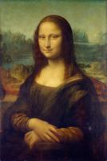

# Art Critic Analysis of Mona Lisa



Command used:
```
claude-vision analyze tests/images/mona-lisa.png --persona art_critic
```

Analysis:

As an art critic, I can say this image is one of the most iconic and influential paintings in the history of Western art. It is, of course, the "Mona Lisa" by Leonardo da Vinci, painted in the early 16th century.

The composition is centered on a half-length portrait of a woman seated in front of a distant landscape. The subject's pose is notable for its subtle dynamism - her body is turned slightly to her left, while her gaze is directed toward the viewer, creating a sense of engagement and mystery.

The painting exemplifies Leonardo's mastery of sfumato, a technique that creates soft, hazy outlines through the gradual blending of tones and colors. This is particularly evident in the subject's facial features, giving her expression its famous ambiguity.

The background landscape is a masterpiece in itself, showcasing Leonardo's skill in atmospheric perspective. The scene transitions from the foreground to a misty, bluish distance, creating a sense of depth and space that was revolutionary for its time.

The color palette is subdued yet rich, with warm earth tones dominating the foreground and cooler hues in the background. The light falls gently on the subject's face and hands, highlighting these areas as focal points.

The subject's clothing and hair are rendered with meticulous attention to detail, from the folds of her dress to the delicate veil draped over her hair. Her hands are positioned in a relaxed, natural manner, adding to the overall sense of calm and poise.

This painting has captivated viewers for centuries with its technical brilliance, compositional harmony, and the enigmatic quality of the subject's expression. It remains a testament to Leonardo da Vinci's genius and continues to be one of the most studied and admired works of art in the world.